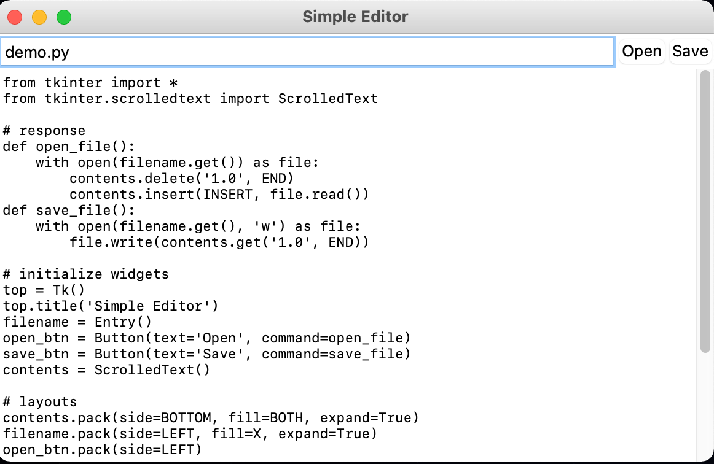

# Graphical User Interfaces

## Tkinter -- Standard GUI Toolkit for Python

- wrapper functions for *Tcl/Tk*
- provides classes which allows display, positioning and control of widgets

## Widgets

### Toplevel widgets

#### *Tk*

- acts as the main window

#### *Toplevel*

- represents a toplevel window beyond the main one

### Others

- won't be visible unless configured with a *layout manager*

#### *Button*

#### *Label*

- simply a text label

## Properties

- properties of widgets are specified with keyword arguments
- or dic-like key-value pairs

### Appearance

```python
>>> btn['text'] = 'Click me!'
```

### behavior

```python
>>> def clicked():
···     print('I was clicked!')
···
>>> btn['command'] = clicked
```

### Set several properties at once

#### *config* method

```python
>>> btn.config(text='Click me!', command=clicked)
```

#### using constructor

```python
>>> Button(text='Click me!', command=clicked)
```

## Layout

### layout manager

- used to achieve self-adjustment of components when their parent components are resized
- stick to a single layout manager for one container to avoid trouble

#### *pack*

- *pack(side[, fill[, epxand]])* method
  - if called without arguments, widgets will be stacked in a top-down, single, centered column,
  - *side*: the side you pack a widget on
    - can be *LEFT*, *RIGHT*, *TOP*, or *BOTTOM*
  - *fill*: fill out the space assigned to it in the *x* or *y* direction
  - can be *X*, *Y*, or *BOTH*
  - *expand*: wether the widget grows asthe parent grows
  - check `help(Pack.config)` for help

#### *grid*

- lets you lay out widgets by placing them in the cells of an invisible table by specifying a row and column
- if the widgets span multiple rows or columns --> *rowspan* or *columnspan*
- check `help(Grid.configure)` for help

#### *place*

- lets you lay out widgets by specifying the coordinates *x* and *y*, and *height* and *weight*
- check `help(Place.config)` for help

## Event Handling

- by setting the *command* property
- *bind(sequence, func)* method
  - *sequence*: a string of conactenated event patterns
    - event pattern is of the form <MODIFIER-MODIFIER-TYPE-DETAIL>
  - *func*: defines the response
    - takes an event object as its argument
    - an event object has various properties depending on the kind of the event

## Practice: a Text Editor

```python
from tkinter import *
from tkinter.scrolledtext import ScrolledText

# response
def open_file():
    with open(filename.get()) as file:
        contents.delete('1.0', END)
        contents.insert(INSERT, file.read())
def save_file():
    with open(filename.get(), 'w') as file:
        file.write(contents.get('1.0', END))

# initialize widgets
top = Tk()
top.title('Simple Editor')
filename = Entry()
open_btn = Button(text='Open', command=open_file)
save_btn = Button(text='Save', command=save_file)
contents = ScrolledText()

# layouts
contents.pack(side=BOTTOM, fill=BOTH, expand=True)
filename.pack(side=LEFT, fill=X, expand=True)
open_btn.pack(side=LEFT)
save_btn.pack(side=LEFT)


mainloop()
```



